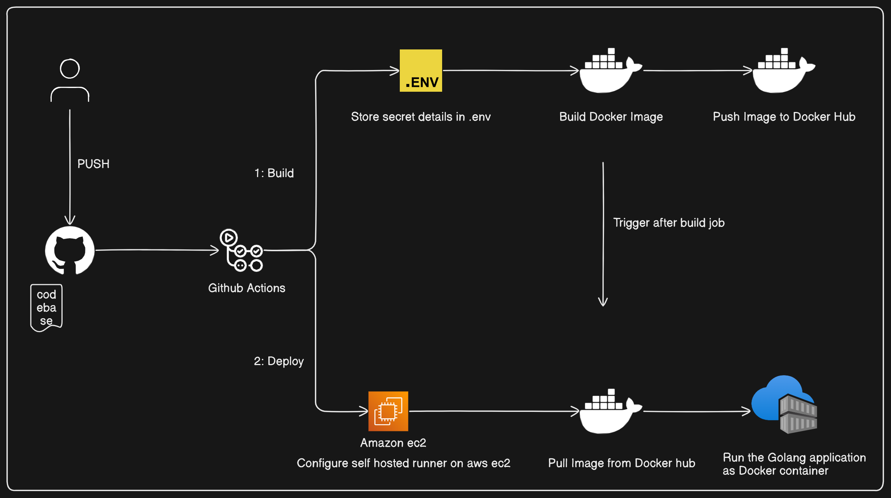
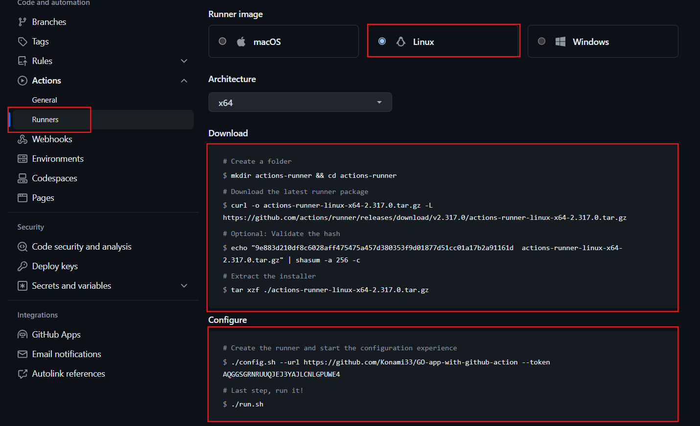
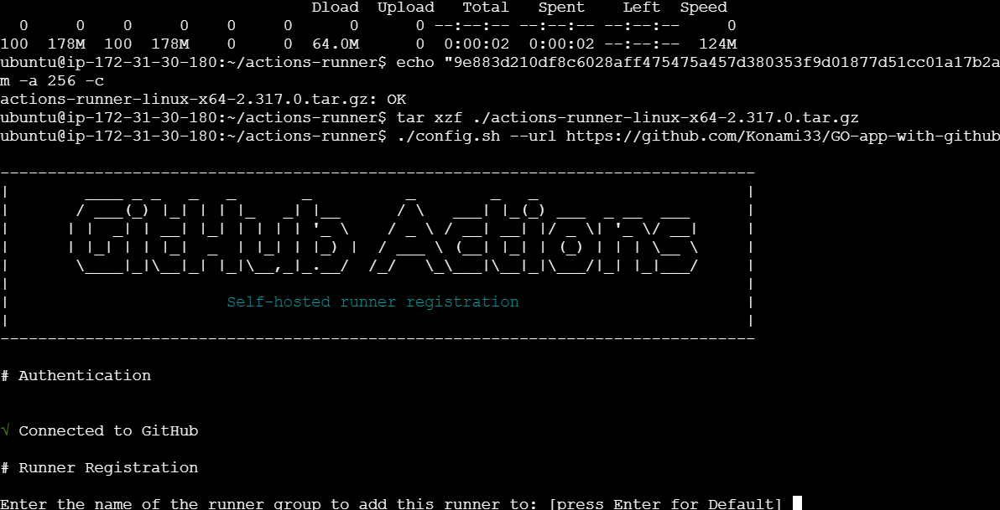
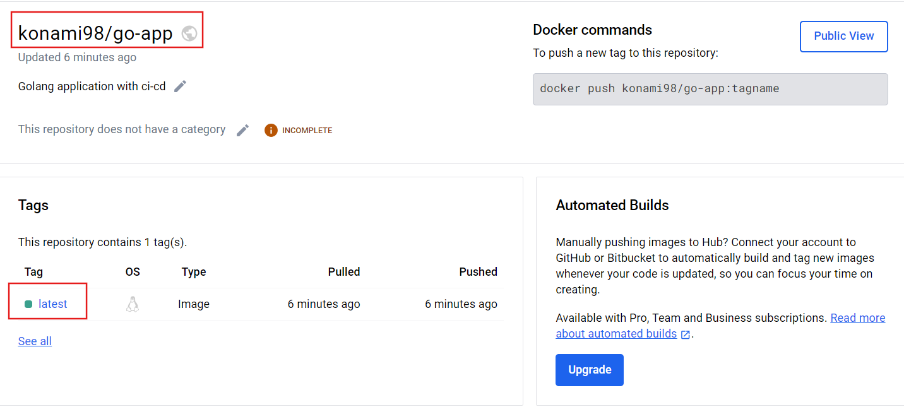

# Auto-Deploy Go App on AWS EC2 by Building a Docker Image and Publish it to Dockerhub using Github Actions with CI/CD Pipeline using GitHub Actions

In this guide, we'll walk you through the process of setting up automatic deployment for a golang application on an AWS EC2 instance by building a docker image and push it to docker hub using a `CI/CD` pipeline with GitHub Actions. We'll learn how to configure EC2 instance, set up GitHub repository, and create workflows that ensure the app is deployed seamlessly whenever we push changes to the main branch of our repository. Let's get started!



## Prerequisites
1. **AWS Account**: Ensure you have an AWS account and proper permissions to create and manage EC2 instances.
2. **GitHub Account**: Ensure you have a GitHub account and a repository for your Node.js project.
3. **Golang**: Ensure you have Golang installed on your local machine to develop the golang application.

## Set up and initialize Local Golang Project

1. Create a New Directory for Your Project:
```sh
mkdir go-app
cd go-app
```
2. Initialize a New Go Module:
Go modules are the standard for dependency management in Go.
```sh
go mod init go-app
```
3. Create a Simple HTTP Server

Create a new file named `main.go`:

```go
package main

import (
	"fmt"
	"net/http"
)

func helloHandler(w http.ResponseWriter, r *http.Request) {
    fmt.Fprintf(w, "Hello, World from GO application!")
}

func main() {
	http.HandleFunc("/", helloHandler)
	fmt.Println("Server is listening on port 8080...");
	http.ListenAndServe(":8080", nil)
}
```

4. Run the http server to ensure all are working fine

```sh
go run main.go
```
Open your browser and navigate to http://localhost:8080 to see "Hello, World!".

5. Now create a Dockerfile: 
Create a file named Dockerfile in the `go-app` directory with the following content:
```Dockerfile
FROM golang:1.22.2-alpine

WORKDIR /app

COPY go.mod ./

RUN go mod tidy

COPY . .

RUN go build -o main ./main.go

RUN chmod +x main

EXPOSE 8080

CMD [ "./main" ]
```
## Setup CI/CD Pipeline with GitHub Actions

### Create GitHub Actions Workflow

At the root directory create a folder named `.github`. Then in the `.github` directory create another directory named `workflows`. Afterthat under the `workflows` directory create a file named `cicd.yml`. Then add the following content in the file:

```yml
name: Deploy Go Application

on:
  push:
    branches:
      - main

jobs:
  build:
    runs-on: ubuntu-latest
    steps:
      - name: Checkout Source
        uses: actions/checkout@v4

      - name: Create .env file
        run: echo "PORT=${{ secrets.PORT }}" >> .env

      - name: Login to Docker Hub
        env:
          DOCKER_USERNAME: ${{ secrets.DOCKER_USERNAME }}
          DOCKER_PASSWORD: ${{ secrets.DOCKER_PASSWORD }}
        run: echo "${DOCKER_PASSWORD}" | docker login -u "${DOCKER_USERNAME}" --password-stdin

      - name: Build Docker image
        run: docker build -t konami98/go-app .

      - name: Push image to Docker Hub
        run: docker push konami98/go-app:latest

  deploy:
    needs: build
    runs-on: self-hosted
    steps:
      - name: Pull Docker image
        run: docker pull konami98/go-app:latest

      - name: Delete old container
        run: docker rm -f go-app-container || true

      - name: Run Docker container
        run: docker run -d -p 8080:8080 --name go-app-container konami98/go-app:latest
```

This GitHub Actions workflow is set up to `build` and `deploy` a Go application as a `Docker container`. It triggers on a push to the `main` branch, `builds` the Docker image, `pushes` it to Docker Hub, and `deploys` it by running the Docker container on a self-hosted runner.

- **Secrets Configuration**: Ensure the secrets `PORT`, `DOCKER_USERNAME` and `DOCKER_PASSWORD` are correctly set in your GitHub repository.

## Here's how to set up and verify your secrets in your GitHub repository:

### Step-by-Step Guide to Setting Up Secrets

1. **Navigate to Your Repository on GitHub**:
   - Go to the repository where your workflow file is located.

2. **Go to Settings**:
   - Click on the `Settings` tab of your repository.

3. **Access Secrets**:
   - On the left sidebar, find and click on `Secrets` and then `Actions`.

4. **Add New Secrets**:
   - Click the `New repository secret` button.
   - Add the `PORT` secret:
     - **Name**: `PORT`
     - **Value**: port number
   - Add the `DOCKER_USERNAME` secret:
     - **Name**: `DOCKER_USERNAME`
     - **Value**: Your Docker Hub username
   - Add the `DOCKER_PASSWORD` secret:
     - **Name**: `DOCKER_PASSWORD`
     - **Value**: Your Docker Hub password

5. **Verify**:
   - Ensure secrets are correctly added and have the correct names (`PORT`, `DOCKER_USERNAME` and `DOCKER_PASSWORD`).


## Setup AWS EC2 Instance

## Setup AWS EC2 Instance
1. **Login to AWS Console**: Login to your AWS account.
2. **Launch EC2 Instance**:
   - Choose "Ubuntu" as the operating system.
   - Ensure it's a free-tier eligible instance type.

        

   - Create a new key pair or use an existing one.

        
3. **Configure Security Group**:
    - Go to security group > select the one for our instance > Edit inbound rules.
    - Allow SSH (port 22) from your IP.
    - Allow HTTP (port 8080) from anywhere. As we will run our container in 8080 port.

## Connect to EC2 Instance

1. EC2 Instance Connect:
- Go to your instance and click on connect.
- Click on "EC2 Instance Connect".

2. Click on "Open Terminal" to open the terminal in your browser.
3. Install Docker on EC2 Instance
- Run the following command to install Docker on your EC2 instance.
```sh
sudo apt update
sudo apt install vim -y
```
Save this `install.sh` script file:
```sh
#!/bin/bash

# Update package database
#!/bin/bash

# Update package database
echo "Updating package database..."
sudo apt update

# Upgrade existing packages
echo "Upgrading existing packages..."
sudo apt upgrade -y

# Install required packages
echo "Installing required packages..."
sudo apt install -y apt-transport-https ca-certificates curl software-properties-common

# Add Docker’s official GPG key
echo "Adding Docker’s GPG key..."
curl -fsSL https://download.docker.com/linux/ubuntu/gpg | sudo gpg --dearmor -o /usr/share/keyrings/docker-archive-keyring.gpg

# Add Docker APT repository
echo "Adding Docker APT repository..."
echo "deb [arch=amd64 signed-by=/usr/share/keyrings/docker-archive-keyring.gpg] https://download.docker.com/linux/ubuntu $(lsb_release -cs) stable" | sudo tee /etc/apt/sources.list.d/docker.list > /dev/null

# Update package database with Docker packages
echo "Updating package database with Docker packages..."
sudo apt update

# Install Docker
echo "Installing Docker..."
sudo apt install -y docker-ce

# Start Docker manually in the background
echo "Starting Docker manually in the background..."
sudo dockerd > /dev/null 2>&1 &

# Add current user to Docker group
echo "Adding current user to Docker group..."
sudo usermod -aG docker ${USER}

# Apply group changes
echo "Applying group changes..."
newgrp docker

# Set Docker socket permissions
echo "Setting Docker socket permissions..."
sudo chmod 666 /var/run/docker.sock

# Print Docker version
echo "Verifying Docker installation..."
docker --version

# Run hello-world container in the background
echo "Running hello-world container in the background..."
docker run -d hello-world

echo "Docker installation completed successfully."
echo "If you still encounter issues, please try logging out and logging back in."
```
```sh
chmod +x install.sh
./install.sh
```

This will install the docker on the aws terminal.


## Setup GitHub Actions Runner on EC2

### Setup GitHub Actions:

- Go to your repository’s settings on GitHub.
- Under “Actions”, click “Runners” and add a new self-hosted runner for Linux.

    
- Follow the commands provided to set up the runner on your EC2 instance.

    

- You will get something like this after the final command (marked portion):

    

## Configuring the self-hosted runner application as a service
Initially the runner in the github repository will be offline state if you exit the terminal. But You can configure the self-hosted runner application as a service to automatically start the runner application when the machine starts.

1. Install the service with the following command:
```sh
sudo ./svc.sh install
```
2. Start the service with the following command:
```sh
sudo ./svc.sh start
```

Now the runner in the github repository is no more in Offline state:


### Deploy and Verify
1. **Push Changes to GitHub**: Commit and push changes to your GitHub repository.
2. **Check GitHub Actions**: Ensure the workflow runs successfully and deploys the updated code to your EC2 instance.


*Build logs and deploy logs:*


3. Verify if the docker image is pushed to Docker hub successfully:



4. Now check in the aws terminal if the Docker container is running:

```sh
docker ps
```
5. Now Goto the browser and visit:

```sh
http://<public-ip>:8080
```

You will see the go application is running.


So the new endpoint has been automatically added to our AWS deployment running as a docker container.


### Conclusion
This guide covers the setup of a CI/CD pipeline to automatically deploy a golang application on an AWS EC2 instance using GitHub Actions. By following these steps, you can automate your deployment process, ensuring consistent and reliable updates to your application.

